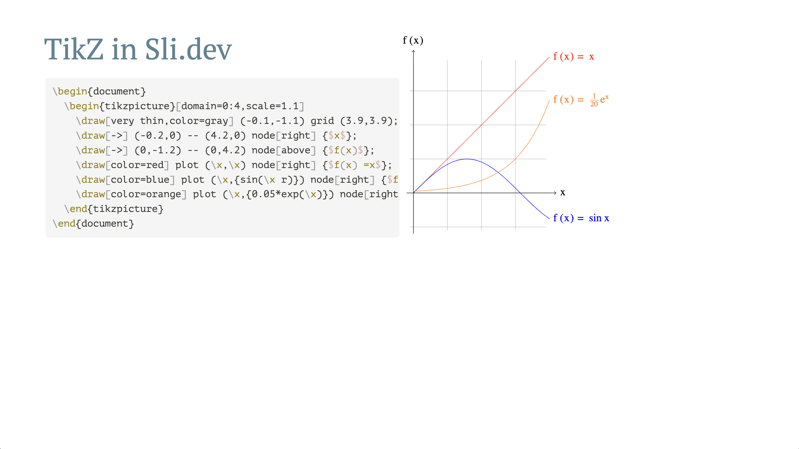

# Slidev Addon TikZJax

> [!WARNING]
> 
> It is unstable for this approach to handle modules like `circuitikz`, `pgfplot`, etc.
> It may crash some time, since the `.sty` file may not find due to instability of `node-tikzjax`.

[Sli.dev](https://sli.dev/) addon $\mathrm{Ti}k\mathrm{ZJax}$, which can compile TikZ source to plot for presentations in sli.dev.

This project utilizes [node-tikzjax](https://www.npmjs.com/package/node-tikzjax/v/1.0.0), which can compile TeX to SVG.

Thanks, @kermanx, for providing advice on writing addons!

## License

The [node-tikzjax](https://www.npmjs.com/package/node-tikzjax/v/1.0.0) uses LPPL-1.3c license.
However, this project only use it in *runtime* and **will not bundle the library into production**, which means it is not the *modification* or *redistribution*.
Thus, these code are following **MIT License**.
However, if anyone uses this project into bundle, **you should follow the LPPL-1.3c**.
By default, you can just ignore this because it will not bundle to production unless you manually take extra actions.